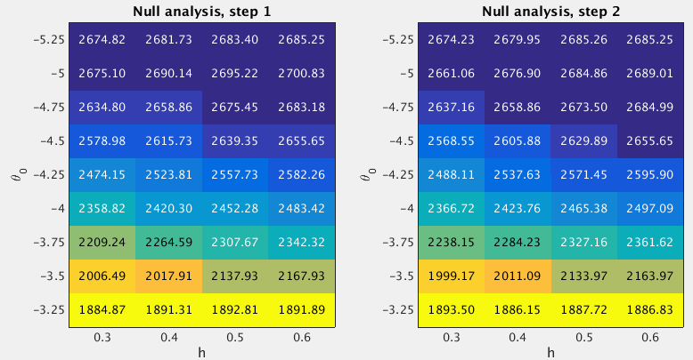

## GSEA Round 1 {#load2013-1}

**Last updated:** `r Sys.Date()`

**Code version:** `r system("git log -1 --format='%H'", intern = TRUE)`

### Fit the null model

I used the grids `theta0=(-5.25:0.25:-3.25)'` and `h=(0.3:0.1:0.6)'` when fitting the null model. I estimated the (unnormalized) log importance weights ("pseudo-likelihoods") for all 36 sets of `(h,theta0)` under null. 
```{r,echo=FALSE}

```

After normalizing the log "pseudo-likelihoods" (`logw.step*`) to posterior probabilities (`posp.step*`), we can see that almost 92.5% posterior mass is concentrated on the setting `(h=0.6, theta0=-5)`.
```{r, include=FALSE}
# load the results
null.path <- "~/Dropbox/rss/Data/load_2013/pathway/load2013_null_201604.mat"
null.results <- R.matlab::readMat(null.path)

null.df <- data.frame(
  theta0 <- c(null.results$theta0.vec),
  h <- c(null.results$h.vec),
  logw.step1 <- c(null.results$logw.step1.vec),
  logw.step2 <- c(null.results$logw.step2.vec)
)
names(null.df) <- c("theta0","h","logw.step1","logw.step2")

# normalize the log importance weights
null.df$posp.step1 <- normalize.logw(null.df$logw.step1)
null.df$posp.step2 <- normalize.logw(null.df$logw.step2)
```

```{r, echo=FALSE}
DT::datatable(null.df,rownames=FALSE,class="display",extensions="KeyTable",options=list(keys=TRUE)) %>% DT::formatRound(c("logw.step1","logw.step2"), 2) %>% DT::formatRound(c("posp.step1","posp.step2"), 4)
```

### Fit the enrichment model

To perform GSEA, I set `(h=0.6, theta0=-5)`, since the null analysis suggests that almost 92.5% posterior mass is placed on this setting. For the log-fold enrichment parameter, I use the grid `theta=(0:0.025:5)'`. The following table lists the GSEA results. 
```{r, eval=FALSE}
gsea.path <- "~/Dropbox/rss/Data/cad_2015/pathway/cad2015_pathway_201604.mat"
gsea.df <- gsea.mat2df(gsea.path) 
```

```{r, eval=FALSE}
DT::datatable(gsea.df,rownames=FALSE,class="display",filter="bottom",colnames = c("gene"="numgene","snp"="numsnps"),extensions="FixedColumns",options=list(dom='lftp',scrollX=TRUE,fixedColumns=TRUE)) %>% DT::formatRound(c("log10.bf","theta.95lb","theta.95ub"), 2) %>% DT::formatRound(c("theta.mean"), 3)
```


